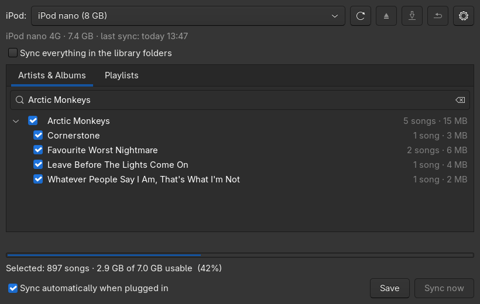

# Quod Pod Sync

Syncs iPods running Apple's own firmware with a music folder on Linux. Pick per iPod what belongs on it, plug it in, and it fills itself. Ratings and play counts travel back from the device into your files.

|               |                                                                     |
| ------------- | ------------------------------------------------------------------- |
| **Devices**   | iPod Classic, Nano and the older ones (tested: Classic 6G, Nano 4G) |
| **Selection** | artists, albums and playlists with checkboxes, or everything        |
| **Playlists** | from a folder of `.m3u` files or from Quod Libet                    |
| **Ratings**   | both ways, stored in the song file's `POPM` tag                     |
| **Automatic** | syncs when an iPod is plugged in                                    |
| **Writes to** | the iPod and `POPM` tags, never your audio files                    |
| **Also does** | copies songs off the iPod into a folder you choose                  |

The iPod's database is backed up before every write, and the last ten are kept.



## Contents

- [Quick start](#quick-start)
- [How it decides](#how-it-decides)
- [Ratings and play counts](#ratings-and-play-counts)
- [Playlists](#playlists)
- [Copying songs off the iPod](#copying-songs-off-the-ipod)
- [Beyond the window](#beyond-the-window)
- [Files](#files)
- [When something breaks](#when-something-breaks)

---

## Quick start

### 1. Install

```bash
./install.sh
```

Installs into `~/.local`, no root needed: the command, the menu entry, the autosync service and two Quod Libet entries. It needs `python-mutagen python-gobject gtk3 libgpod gcc pkgconf` and says so if something is missing.

### 2. Choose what goes on the iPod

Start **Quod Pod Sync**, tick artists, albums or playlists, or "Sync everything". The bar at the bottom shows whether the selection fits.

### 3. Save, then Sync now

A confirmation window shows what will change first. After that, plugging the iPod in syncs it on its own.

## How it decides

**Songs are recognized by their identity, not their path.** Where the tags carry an identifier (ISRC, or a source link if the song was downloaded) that is used first, otherwise artist and title after normalizing, which covers everything else. So renaming an artist or fixing a tag does not cause the song to be copied again.

**The iPod mirrors the selection.** Missing songs are copied, songs that are no longer selected are removed from the device. Your library is never touched.

**A song that exists twice in the library** matches the copy that is actually selected, so it does not bounce between syncs.

## Ratings and play counts

| Change                           | What happens                             |
| -------------------------------- | ---------------------------------------- |
| Rating set on the iPod           | goes into the song file, higher or lower |
| Rating set in your library       | goes onto the iPod                       |
| Both changed since the last sync | the newer one wins, the case is printed  |
| Plays counted on the iPod        | added to the count in the file           |

Ratings live in the `POPM` tag under Quod Libet's address, so Quod Libet shows them and other tools can read them. `POPM` entries written by other programs are left alone, because not every one of them is a rating.

## Playlists

**Source:** a folder of `.m3u` files if one is configured (settings key `playlists`, or a `920_Playlists` folder next to your library), otherwise Quod Libet's own playlists.

**Ticked playlists** are written to the iPod, and their songs are part of the selection.

**Playlists made on the iPod** (a saved On-The-Go list) are imported into the playlist source at the next sync and become normal ticked playlists.

## Copying songs off the iPod

The button with the save icon copies songs from the device into a folder you pick, in the same Artist/Album layout, using the tags in the files. By default only songs that are **not** in your library, which is the case that matters: music that exists only on that iPod.

Nothing on the iPod is changed, and a song already in the target folder at the same size is skipped.

## Beyond the window

Everything also works from a terminal, for example to sync without opening the window or to put an earlier iPod database back:

```bash
quod-pod-sync --help
```

In Quod Libet, **Send to iPod** and **Sync playlist to iPod** appear in the right-click menu once the Custom Commands plugin is enabled.

## Files

| Path                                           | What                                                       |
| ---------------------------------------------- | ---------------------------------------------------------- |
| `~/.config/quodpodsync/settings.json`          | library folders, playlist source                           |
| `~/.config/quodpodsync/profiles/<serial>.json` | what belongs on that iPod                                  |
| `~/.cache/quodpodsync/`                        | tag caches, so a sync stays fast                           |
| `~/.local/share/quodpodsync/backups/`          | iPod databases, the last ten per device                    |
| `quodpodsync/`                                 | engine, window, command line                               |
| `native/ipod-db.c`                             | the libgpod helper that reads and writes the iPod database |

`./uninstall.sh` removes the app and keeps your profiles; `--purge` deletes those too.

## When something breaks

| Symptom                              | Cause and fix                                                                                 |
| ------------------------------------ | --------------------------------------------------------------------------------------------- |
| iPod shows no songs                  | its database was not signed. One more sync fixes it.                                          |
| `libgpod.so.4 missing`               | removed as an unused dependency of another program. The window offers to install it again     |
| Songs are there but not in the menus | the iPod needs its model in `iPod_Control/Device/SysInfo`. Quod Pod Sync fills that in itself   |
| A sync removes more than expected    | autosync refuses to remove more than a quarter of a device without confirmation in the window |
| Ratings missing after a sync         | the restore button next to the iPod selector lists the database backups                       |

Newer iPods (Classic, Nano 3G and later) only show songs from a signed database, which needs the device's FireWire GUID and model. Quod Pod Sync takes both from the USB connection when the iPod's own file is empty.

---

MIT licensed, see [LICENSE](LICENSE). The helper that talks to the iPod links against [libgpod](https://sourceforge.net/projects/gtkpod/) (LGPL-2.1), which does the actual database work.
